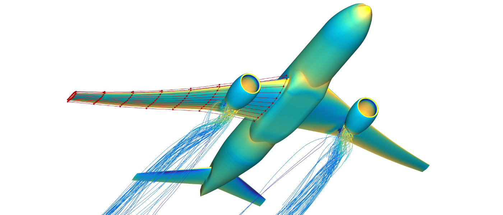

DAFoam: Discrete Adjoint with OpenFOAM
======================================

 

DAFoam develops an efficient discrete adjoint method to perform high-fidelity multidisciplinary design optimization. DAFoam has the following features:

- It uses a popular open-source package [OpenFOAM](https://www.openfoam.com) for multiphysics analysis.
- It implements a [Jacobian-free discrete adjoint](https://www.sciencedirect.com/science/article/abs/pii/S0376042119300120) approach with competitive speed, scalability, and accuracy.
- It has a convenient Python interface to couple with [OpenMDAO](https://openmdao.org) for multidisciplinary design optimization.

Documentation
-------------

Refer to https://dafoam.github.io for installation, documentation, and tutorials.

Citation
--------

Please cite the following papers in any publication for which you find DAFoam useful. 

- Ping He, Charles A. Mader, Joaquim R.R.A. Martins, Kevin J. Maki. DAFoam: An open-source adjoint framework for multidisciplinary design optimization with OpenFOAM. AIAA Journal, 58:1304-1319, 2020. https://doi.org/10.2514/1.J058853

- Ping He, Charles A. Mader, Joaquim R.R.A. Martins, Kevin J. Maki. An aerodynamic design optimization framework using a discrete adjoint approach with OpenFOAM. Computer & Fluids, 168:285-303, 2018. https://doi.org/10.1016/j.compfluid.2018.04.012

License
-------

Copyright 2019 MDO Lab

Distributed using the GNU General Public License (GPL), version 3; see the LICENSE file for details.
