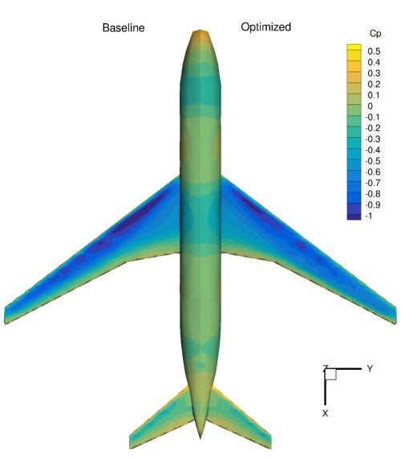
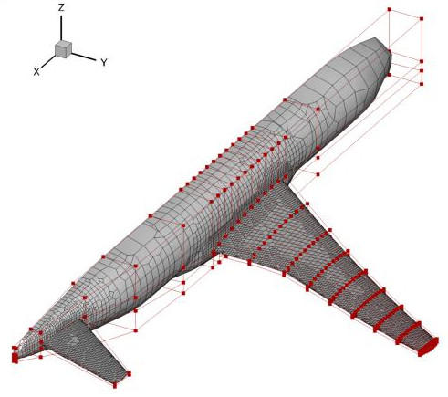

.. _Aerodynamics_DPW4:

Aircraft wing-body-tail configuration
-------------------------------------

**NOTE**: Before running this case, please read the instructions in :ref:`Aerodynamics_NACA0012_Incomp` to get an overall idea of the DAFoam optimization setup.

This is a trimmed aerodynamic shape optimization case for an aircraft wing-body-tail configuration at transonic conditions. The summary of the case is as follows:

    | Case: Aircraft aerodynamic optimization
    | Geometry: CRM wing, body, and tail
    | Objective function: Drag coefficient
    | Design variables: 216 FFD points moving in the z direction, 9 wing twists, one tail rotation, one angle of attack
    | Constraints: Volume, thickness, LE/TE, and lift constraints (total number: 771)
    | Mach number: 0.85
    | Reynolds number: 5 million
    | Mesh cells: 100K
    | Adjoint solver: rhoSimpleCDAFoam

To run this case, first source the DAFoam environment (see :ref:`Tutorials`). Then you can go into the **run** folder and run::

  ./Allrun.sh 4

The optimization progress will then be written in the **log.opt** file. 
**NOTE**, we recommend running this case on an HPC system using at least 4 CPU cores.

For this case, the optimization converges in 20 steps, see the following figure. 
The baseline design has C_D=0.05242, C_L=0.5000, C_M=-0.02611 and the optimized design has C_D=0.04997, C_L=0.4999, C_M=0.00015.

In this case, we need to use rhoSimpleCDAFoam, a compressible solver that uses the SIMPLEC algorithm. 
The case setup is similar to the :ref:`Aerodynamics_NACA0012_Comp` except that we have more design variables and constraints.
The mesh and FFD points are as follows.

We use the OpenFOAM's built-in mesh tool ``snappyHexMesh`` to generate the unstructured hexa mesh.
We use ICEM to generate the body-fitted FFD points.
We define two more global design variables: twist and tailTwist::

  def twist(val, geo):
      # Set all the twist values
      for i in xrange(nTwist):
          geo.rot_y['wing'].coef[i+1] = val[i]
  
      # Also set the twist of the root to the SOB twist
      geo.rot_y['wing'].coef[0] = val[0]
  
  def tailTwist(val, geo):
      # Set one twist angle for the tail
      geo.rot_y['tail'].coef[:] = val[0]

We then add them into the DVGeo object::

  DVGeo.addGeoDVGlobal('twist', 0*np.zeros(nTwist), twist,lower=lower, upper=upper, scale=0.1)
  DVGeo.addGeoDVGlobal('tail', 0*np.zeros(1), tailTwist,lower=-10, upper=10, scale=0.1)