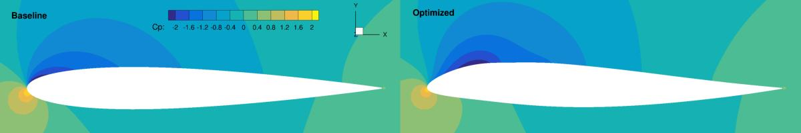
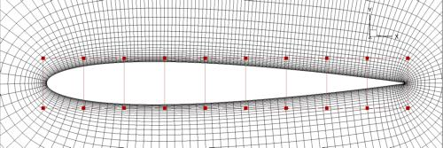

.. _Aerodynamics_NACA0012_Incomp:

NACA0012 airfoil incompressible
-------------------------------

This is an aerodynamic shape optimization case for an airfoil at low speed. The summary of the case is as follows:

    | Case: Airfoil aerodynamic optimization 
    | Geometry: NACA 0012
    | Objective function: Drag coefficient
    | Design variables: 40 FFD points moving in the y direction, one angle of attack
    | Constraints: Symmetry, volume, thickness, and lift constraints (total number: 123)
    | Mach number: 0.1
    | Reynolds number: 2.3 million
    | Mesh cells: 8.6K
    | Adjoint solver: simpleDAFoam

The configuration files are available at `Github <https://github.com/mdolab/dafoam/tree/master/tutorials/Aerodynamics/NACA0012_Airfoil_Incompressible>`_. To run this case, first source the DAFoam environment (see :ref:`Tutorials`). Then you can go into the **run** folder and run::

  ./Allrun.sh 1

The optimization progress will then be written in the **log.opt** file. 

For this case, the optimization converges in 6 steps, see the following figure. 
The baseline design has C_D=0.01316, C_L=0.3750, and the optimized design has C_D=0.01273, C_L=0.3750.

Now we elaborate on the details of optimization configurations.
The Allrun.sh script has three sections. 
In the first section, we check if the OpenFOAM environments are loaded::

  if [ -z "$WM_PROJECT" ]; then
    echo "OpenFOAM environment not found, forgot to source the OpenFOAM bashrc?"
    exit
  fi
  
  if [ -z "$1" ]; then
    echo "No argument supplied!"
    echo "Example: ./Allrun.sh 1"
    echo "This will run the case using 1 CPU core."
    exit
  fi

In the second section, we generate a structured mesh using the `pyHyp <https://github.com/mdolab/pyhyp>`_ package::

  # generate mesh
  echo "Generating mesh.."
  python genAirFoilMesh.py > log.meshGeneration
  plot3dToFoam -noBlank volumeMesh.xyz >> log.meshGeneration
  autoPatch 30 -overwrite >> log.meshGeneration
  createPatch -overwrite >> log.meshGeneration
  renumberMesh -overwrite >> log.meshGeneration
  echo "Generating mesh.. Done!"

Here the genAirFoilMesh.py script reads the NACA 0012 profile, generates a surface mesh, and calls pyHyp to generate a volume mesh. 
DAFoam does not support pure 2D cases, so we use one cell in the spanwise (z) direction and impose the symmetry boundary condition. 
The pyHyp will output the volume mesh in plot3D format (.xyz). 
We convert it to OpenFOAM meshes using the **plot3dToFoam**, **autoPatch**, **createPatch**, and **renumberMesh** utilities in OpenFOAM. 
Refer to `Mesh Generation in OpenFOAM <https://www.openfoam.com/documentation/user-guide/mesh.php>`_ for detailed instructions.
The mesh is as follows:

Here the red squares are the FFD control points to morph the airfoil shape. 
**NOTE**: make sure the design surfaces are completely within the FFD volume, otherwise, you will see errors.
The FFD file is in plot3D format and is located in FFD/wingFFD.xyz. 
You can use the genFFD.py script to generate this FFD file by running ``python genFFD.py``. 
Alternatively, you can use advance software such as ICEM for more complex FFD point generation. 
You can use Paraview to view the plot3D files (remember to uncheck **Binary File** and check **Multi Grid**), 
or you can convert the plot3D mesh to OpenFOAM format by using the plot3dToFoam utility (see the example above).

In the third section, we run these commands to start the optimization::

  # these are the actually commands to run the case
  ./foamRun.sh $1 &
  sleep 1
  echo "Running the optimization. Check the log.opt file for the progress."
  mpirun -np $1 python runScript.py &> log.opt 

DAFoam has two major layers: OpenFOAM and Python, and they interact through file IO. 
The first command ``./foamRun.sh $1 &`` runs a bash script for the OpenFOAM layer and put it to background. 
This bash script will detect file output from the Python layer and run the corresponding executives, 
i.e., run the coloring, check the mesh quality, simulate the flow, and compute the adjoint derivatives. 
You need to change the names of the executives in foamRun.sh if you want to use different primal and adjoint solvers. 

The second command ``mpirun -np $1 python runScript.py &> log.opt`` runs the Python layer and outputs the optimization log to log.opt.
All the optimization configurations are defined in runScript.py.
As mentioned in :ref:`Tutorials`, the runScript.py has seven sections. 
We need to modify the **Input Parameters**, **DVGeo**, and **DVCon** sections for different optimization cases.
Taking the runScript.py in tutorials/Aerodynamics/NACA0012_Airfoil_Incompressible as an example, we first define the input argument as follow::

  parser.add_argument("--output", help='Output directory', type=str,default='../optOutput/')
  parser.add_argument("--opt", help="optimizer to use", type=str, default='slsqp')
  parser.add_argument("--task", help="type of run to do", type=str, default='opt')
  parser.add_argument('--optVars',type=str,help='Vars for the optimizer',default="['shape']")

Here the --output argument defines where the intermediate results are stored, the default is ../optOutput.
The intermediate results contain the OpenFOAM 3D flow fields, design variables, objective and derivatives values, flow and adjoint solution log files, check mesh quality logs for each optimization iteration.
We do not store the adjoint vectors but they are available in the ``run`` folder with names ``psi_*``.
The adjoint vectors are stored in the same order as the state variables, either in state-by-state or cell-by-cell order. 
Refer to `this paper <https://doi.org/10.1016/j.paerosci.2019.05.002>`_ for details. 
Note that the adjoint vectors are scaled based on the values defined by ``stateScaling`` in ``adjointDict``.
The --opt argument defines which optimizer to use. 
pyOptsparse supports multiple optimizers, here we pre-define some parameters for SNOPT, SLSQP, IPOPT, and PSQP.
SLSQP (default), IPOPT, and PSQP are open souce while SNOPT is not.
The --task argument defines what task to perform, the options are: ``run`` (just run the flow and adjoint once), ``opt`` (optimization), ``testsensshape`` (test the accuracy of sensitivity wrt to shape variables), ``testsensuin`` (test the accuracy of sensitivity wrt to the inlet boundary conditions), ``solvecl`` (solve for CL; this is for wing cases only), ``plotsensmap`` (plot the sensitivity map).

After this, we define the boundary conditions and reference values::

  pRef       = 0.0              # reference pressure, set it to 0 for incompressible cases
  rhoRef     = 1.0              # reference density, set it to 1 for incompressible cases
  UmagIn     = 35.0             # magnitude of far field velocity
  LRef       = 1.0              # reference length used in momentum coefficient (CM) calculation
  ARef       = 1.0*0.1          # reference area used in drag or lift coefficients (CD, CL) calculations
  CofR       = [0.25,0,0]       # center of rotation used in momentum coefficient (CM) calculation
  CL_star    = 0.375            # the target lift coefficient (lift constraint)
  alpha0     = 3.579107         # initial angle of attack

Then we define a function to compute far field velocity components and drag and lift directions, given the value of angle of attack and far field velocity magnitude::

  def calcUAndDir(UIn,alpha1):
      dragDir = [ np.cos(alpha1*np.pi/180),np.sin(alpha1*np.pi/180),0]
      liftDir = [-np.sin(alpha1*np.pi/180),np.cos(alpha1*np.pi/180),0]
      inletU = [float(UIn*np.cos(alpha1*np.pi/180)),float(UIn*np.sin(alpha1*np.pi/180)),0]
      return inletU, dragDir, liftDir
  
  inletu0, dragdir0, liftdir0 = calcUAndDir(UmagIn,alpha0)

Next, we define the input parameters for optimization in the aeroOptions dictionary. 
The explanation of these input parameters is in `Python layer <_static/Python/index.html>`_. Refer to classes-python-pyDAFoam-PYDAFOAM-aCompleteInputParameterSet().
For this specific case, we have::

  # output options
  'casename':                 'NACA0012_'+task+'_'+optVars[0],   # name of the case
  'outputdirectory':          outputDirectory,                   # path to store the intermediate shapes and flow fields
  'writesolution':            True,                              # write intermediate shapes and flow fields to outputdirectory
  # design surfaces and cost functions 
  'designsurfacefamily':     'designSurfaces',                   # group name of design surface, no need to change
  'designsurfaces':          ['wing','wingte'],                  # names of design surface to morph, these patch names should be in constant/polyMesh/boundary
  'objfuncs':                ['CD','CL'],                        # names of the objective functions 
  'objfuncgeoinfo':          [['wing','wingte'],                 # for each object function, what are their patch names to integrate over
                              ['wing','wingte']],
  'referencevalues':         {'magURef':UmagIn,                  # these are reference values for computing CD, CL, etc.
                              'ARef':ARef,
                              'LRef':LRef,
                              'pRef':pRef,
                              'rhoRef':rhoRef},
  'liftdir':                 liftdir0,                           # drag, lift directions and center of rotation
  'dragdir':                 dragdir0,
  'cofr':                    CofR,
  # flow setup
  'adjointsolver':           'simpleDAFoam',                     # which flow/adjoint solver to use, for incompressible we use simpleDAFoam
  'rasmodel':                'SpalartAllmarasFv3',               # which turbulence model to use
  'flowcondition':           'Incompressible',                   # flow condition, either Incompressible or Compressible
  'maxflowiters':            800,                                # how many steps to run the flow 
  'writeinterval':           800,                                # how many steps to write the flow fields to disks
  'setflowbcs':              True,                               # whether to set/update boundary conditions
  'inletpatches':            ['inout'],                          # names of the farfield or inlet/outlet patches
  'outletpatches':           ['inout'],                         
  'flowbcs':                 {'bc0':{'patch':'inout',            # we can set boundary condition in the python layer, this will overwrite
                                     'variable':'U',             # the boundary conditions in the '0' folder in the OpenFOAM cases.
                                     'value':inletu0},
                              'useWallFunction':'true'},         # we use wall function
  # adjoint setup
  'adjgmresmaxiters':        1000,                               # how many steps to solve the adjoint equations
  'adjgmresrestart':         1000,                               # how many Krylov subspace to keep, always set it to adjgmresmaxiters
  'adjgmresreltol':          1e-6,                               # adjoint GMRE convergence tolerance
  'adjdvtypes':              ['FFD'],                            # types of derivatives, can be FFD (shape variables), UIn (boundary condition)
  'epsderiv':                1.0e-6,                             # the finite-difference step size for state variables in the partial derivative computation for the adjoint
  'epsderivffd':             1.0e-3,                             # the finite-difference step size for shape variables (FFD displacement)
  'adjpcfilllevel':          1,                                  # number of incomplete-LU preconditioning fill-in, set it to higher if you have convergence problems
  'adjjacmatordering':       'cell',                             # how to order the states can be either state or cell
  'adjjacmatreordering':     'natural',                          # how to reorder the states, options are: natural, rcm, nd
  'statescaling':            {'UScaling':UmagIn,                 # give reference values to scale the states
                              'pScaling':UmagIn*UmagIn/2,
                              'nuTildaScaling':1e-4,
                              'phiScaling':1},
  ########## misc setup ##########
  'mpispawnrun':             False,                              # if you want to run this script without the mpirun command (in serial), set it to False, otherwise, True
  'restartopt':              False,                              # whether to restart the optimization
  'meshmaxnonortho':         70.0,                               # these are some thresholds for mesh quality check
  'meshmaxskewness':         10.0,
  'meshmaxaspectratio':      2000.0, 

Next, we need to define the mesh warping parameters::

  # mesh warping parameters, users need to manually specify the symmetry plane
  meshOptions = {'gridFile':                os.getcwd(),
                 'fileType':                'openfoam',
                 # point and normal for the symmetry plane
                 'symmetryPlanes':          [[[0.,0., 0.],[0., 0., 1.]],[[0.,0., 0.1],[0., 0., 1.]]]}

Here we need to manually define the symmetry planes.

Next, we can define some parameters for optimizers, check `pyOptSparse <https://github.com/mdolab/pyoptsparse>`_ for a complete set of parameters for each optimizer::

  # options for optimizers
  outPrefix = outputDirectory+task+optVars[0]
  if args.opt == 'snopt':
      optOptions = {
          'Major feasibility tolerance':  1.0e-6,   # tolerance for constraint
          'Major optimality tolerance':   1.0e-6,   # tolerance for gradient 
          'Minor feasibility tolerance':  1.0e-6,   # tolerance for constraint
          'Verify level':                 -1,       # do not verify derivatives
          'Function precision':           1.0e-6,   
          'Major iterations limit':       20,
          'Nonderivative linesearch':     None, 
          'Major step limit':             2.0,
          'Penalty parameter':            0.0, # initial penalty parameter
          'Print file':                   os.path.join(outPrefix+'_SNOPT_print.out'),
          'Summary file':                 os.path.join(outPrefix+'_SNOPT_summary.out')}
  elif args.opt == 'psqp':
      optOptions = {
          'TOLG':                         1.0e-6,   # tolerance for gradient 
          'TOLC':                         1.0e-6,   # tolerance for constraint
          'MIT':                          20,       # max optimization iterations
          'IFILE':                        os.path.join(outPrefix+'_PSQP.out')}
  elif args.opt == 'slsqp':
      optOptions = {
          'ACC':                          1.0e-5,   # convergence accuracy
          'MAXIT':                        20,       # max optimization iterations
          'IFILE':                        os.path.join(outPrefix+'_SLSQP.out')}
  elif args.opt == 'ipopt':
      optOptions = {
          'tol':                          1.0e-6,   # convergence accuracy
          'max_iter':                     20,       # max optimization iterations
          'output_file':                  os.path.join(outPrefix+'_IPOPT.out')}
  else:
      print("opt arg not valid!")
      exit(0)

Now we can define the design variable in the DVGeo section::

  FFDFile = './FFD/wingFFD.xyz'
  DVGeo = DVGeometry(FFDFile)
  
  # ref axis
  x = [0.25,0.25]
  y = [0.00,0.00]
  z = [0.00,0.10]
  c1 = pySpline.Curve(x=x, y=y, z=z, k=2)
  DVGeo.addRefAxis('bodyAxis', curve = c1,axis='z')
  
  def alpha(val, geo=None):
      inletu, dragdir, liftdir = calcUAndDir(UmagIn,np.real(val))
  
      flowbcs=CFDSolver.getOption('flowbcs')
      for key in flowbcs.keys():
          if key == 'useWallFunction':
              continue
          if flowbcs[key]['variable'] == 'U':
              flowbcs[key]['value'] = inletu
      CFDSolver.setOption('setflowbcs',True)
      CFDSolver.setOption('flowbcs',flowbcs)
      CFDSolver.setOption('dragdir',dragdir)
      CFDSolver.setOption('liftdir',liftdir)
  
  # select points
  pts=DVGeo.getLocalIndex(0) 
  indexList=pts[:,:,:].flatten()
  PS=geo_utils.PointSelect('list',indexList)
  DVGeo.addGeoDVLocal('shapey',lower=-1.0, upper=1.0,axis='y',scale=1.0,pointSelect=PS)
  DVGeo.addGeoDVGlobal('alpha', alpha0,alpha,lower=0, upper=10., scale=1.0)

Here we first load the wingFFD.xyz file and create a DVGeo object. 
Then we add a reference axis defined by the x, y, and z lists. 
The reference axis can be used to define twist design variables. 
The wing sections will then rotate wrt to the reference axis (see the :ref:`Aerodynamics_DPW4` and :ref:`Aerodynamics_Odyssey_Wing` cases for reference).
Next, we define a function ``def alpha`` and use it as the design variable (angle of attack). 
This function will basically change the far field velocity components, drag and lift directions for a given angle of attack. 
Finally, we select the design variable points. 
We first select the first block of the plot3D FFD file ``pts=DVGeo.getLocalIndex(0)``.
We then select all the points in this block ``indexList=pts[:,:,:]``. 
Base on your case setup, you may want to select only parts of the points. 
This can be done by giving a range of indices, e.g., ``pts[1:3,:,:]`` will select points with i=1 to 3, and all j and k indices. 
**NOTE**: for this case, we have only one block for the plot3D file, but you can create multiple blocks. 
For example, if your plot3D file has two blocks and you want to select the 2nd block, do ``pts=DVGeo.getLocalIndex(1)``.
We then call ``DVGeo.addGeoDVLocal`` to add these FFD points as the shape variable, and allow them to move in the y direction with lower and upper bounds -1.0 m and +1.0 m. 
Similarly, ``DVGeo.addGeoDVGlobal`` adds the angle of attack as the design variable. 
See the instructions in `pyGeo <https://github.com/mdolab/pygeo>`_ for more details.

After the design variables are set, we need to impose the relevant constraints::

  # no need to change this block
  DVCon = DVConstraints()
  DVCon.setDVGeo(DVGeo)
  [p0, v1, v2] = CFDSolver.getTriangulatedMeshSurface(groupName=CFDSolver.getOption('designsurfacefamily'))
  surf = [p0, v1, v2]
  DVCon.setSurface(surf)
  
  # define a 2D plane for volume and thickness constraints
  leList = [[1e-4,0.0,1e-4],[1e-4,0.0,0.1-1e-4]]
  teList = [[0.998-1e-4,0.0,1e-4],[0.998-1e-4,0.0,0.1-1e-4]]
  DVCon.addVolumeConstraint(leList, teList, nSpan=2, nChord=50,lower=1.0,upper=3, scaled=True)
  DVCon.addThicknessConstraints2D(leList, teList,nSpan=2,nChord=50,lower=0.8, upper=3.0,scaled=True)
  
  #Create a linear constraint so that the curvature at the symmetry plane is zero
  pts1=DVGeo.getLocalIndex(0)
  indSetA = [] 
  indSetB = []
  for i in range(10):
      for j in [0,1]:
          indSetA.append(pts1[i,j,1])
          indSetB.append(pts1[i,j,0])
  DVCon.addLinearConstraintsShape(indSetA,indSetB,factorA=1.0,factorB=-1.0,lower=0.0,upper=0.0)
  
  #Create a linear constraint so that the leading and trailing edges do not change
  pts1=DVGeo.getLocalIndex(0)
  indSetA = []
  indSetB = []
  for i in [0,9]:
      for k in [0]: # do not constrain k=1 because it is linked in the above symmetry constraint
          indSetA.append(pts1[i,0,k])
          indSetB.append(pts1[i,1,k])
  DVCon.addLinearConstraintsShape(indSetA,indSetB,factorA=1.0,factorB=1.0,lower=0.0,upper=0.0)

Here we first define a 2D plane for volume and thickness constraints by giving ``leList`` and ``teList``.
The thickness constraint function will project the points in the 2D plane to the upper and lower surfaces of the wing, the distance will be the thickness.
Similarly, the volume constraint function will project and form a 3D volume.
Then, we define linear constraints to link the displacements for the FFD points.
Because we use a symmetry plane, we need to link all the y displacement magnitudes between k=0 and k=1.
In addition, we want to fix the leading and trailing edges.
To do this, we set the y displacements at j=0 and j=1 to have the same magnitudes but opposite signs. 
We do this for both i=0 (leading) and i=9 (trailing).
Note that for wing cases, the fixed leading and trailing edge constraints can be easily done by calling::

  # Le/Te constraints
  DVCon.addLeTeConstraints(0, 'iHigh')
  DVCon.addLeTeConstraints(0, 'iLow')

See :ref:`Aerodynamics_DPW4` and :ref:`Aerodynamics_Odyssey_Wing` cases for reference.
Also refer to the instructions in `pyGeo <https://github.com/mdolab/pygeo>`_ for more details.

Next, we define a function to compute objective functions and constraints ``def aeroFuncs(xDV):``.
Similarly, we define a function to compute derivatives ``def aeroFuncsSens(xDV,funcs):``.
These two functions will be given to pyOptSparse for optimization, i.e., ``optProb = Optimization('opt', aeroFuncs, comm=gcomm)`` and ``sol = opt(optProb, sens=aeroFuncsSens, storeHistory=histFile)``.
For optimization, we also need to define the objective function and add physical constraints::

  # Add objective
  optProb.addObj('CD', scale=1)
  # Add physical constraints
  optProb.addCon('CL',lower=CL_star,upper=CL_star,scale=1)

We can add only one objective function, but multiple physical constraints (call ``optProb.addCon`` multiple times). **NOTE**: the geometric constraints have been added in DVGeo.

The above are the basic configurations for DAFoam. Good luck!
