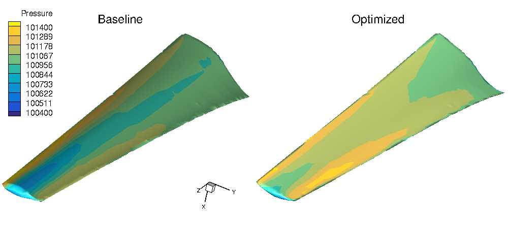

.. _Aerodynamics_NREL6:

Wind turbine
------------

**NOTE**: Before running this case, please read the instructions in :ref:`Aerodynamics_NACA0012_Incomp` to get an overall idea of the DAFoam optimization setup.

This is an aerodynamic shape optimization case for the NREL6 wind turbine. The summary of the case is as follows:

    | Case: Wind turbine aerodynamic optimization
    | Geometry: NREL6
    | Objective function: Torque
    | Design variables: 100 FFD points moving in the x and y directions
    | Constraints: None
    | Inlet velocity: 7 m/s
    | Rotation speed: 7.5 rad/s
    | Mesh cells: 60K
    | Adjoint solver: turboDAFoam

The configuration files are available at `Github <https://github.com/mdolab/dafoam/tree/master/tutorials/Aerodynamics/NREL6>`_. To run this case, first source the DAFoam environment (see :ref:`Tutorials`). Then you can go into the **run** folder and run::

  ./Allrun.sh 8

The optimization progress will then be written in the **log.opt** file. 
**NOTE**, we recommend running this case on an HPC system using at least 8 CPU cores.

For this case, the optimization was run for 5 steps, see the following figure. 
The baseline design has a torque of 631.1 N m, and the optimized design has a torque of 1352.9 N m.

The mesh and FFD points are as follows.
We use snappyHexMesh to generate the meshes.

.. image:: images/NREL6_FFD.jpg
