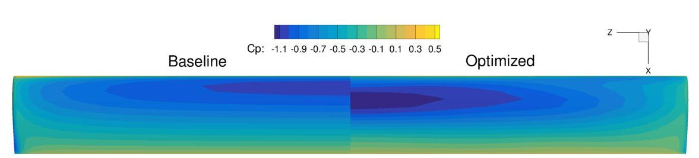

.. _Aerodynamics_Odyssey_Wing:

UAV wing multipoint
-------------------

**NOTE**: Before running this case, please read the instructions in :ref:`Aerodynamics_NACA0012_Incomp` to get an overall idea of the DAFoam optimization setup.

This is a multipoint aerodynamic shape optimization case for a low-speed UAV wing. The summary of the case is as follows:

    | Case: UAV wing multipoint aerodynamic optimization
    | Geometry: Rectangular wing with the Eppler214 profile 
    | Objective function: Weighted drag coefficient at CL=0.6 and 0.75
    | Design variables: 120 FFD points moving in the y direction, 6 twists, two angle of attack
    | Constraints: Volume, thickness, LE/TE, and lift constraints (total number: 414)
    | Mach number: 0.07
    | Reynolds number: 0.9 million
    | Mesh cells: 25K
    | Adjoint solver: simpleDAFoam

The configuration files are available at `Github <https://github.com/mdolab/dafoam/tree/master/tutorials/Aerodynamics/Odyssey_Wing>`_. To run this case, first source the DAFoam environment (see :ref:`Tutorials`). Then you can go into the **MultiPointMain** folder and run::

  ./Allrun.sh 2

The optimization progress will then be written in the **log.opt** file. 

For this case, the optimization converges in 20 steps, see the following figure. 
The baseline design has C_D=0.04019, C_L=0.7500 and the optimized design has C_D=0.03811, C_L=0.7446.

In this case, we use simpleDAFoam.
The case setup is similar to :ref:`Aerodynamics_NACA0012_Incomp` except that we have more design variables and constraints and use a multipoint setup ``'multipointopt':True``.
The mesh and FFD points are as follows.
We use ICEM to generate the body-fitted FFD points.

.. image:: images/Odyssey_Mesh.jpg

In the beginning of the runScript.py script, we define multipoint parameters::

  nProcs     = args.nProcs
  nFlowCases = 2
  CL_star    = [0.6,0.75]
  alphaMP    = [1.768493,3.607844]
  MPWeights  = [0.3,0.7]
  UmagIn     = 24.8
  ARef       = 1.2193524

Here we need to prescribe the number of CPU cores and then provide it later to the multipoint module ``multiPointSparse``.
We setup two flow conditions at C_L=0.6 and 0.75 and their weights are 0.3 and 0.7.
We need to create two folders FlowConfig0 and FlowConfig1 for multipoint runs.
If you have more flow conditions, add more accordingly.

For the multipoint runs, we no longer use a foamRun.sh script, instead, we use foamRunMultiPoint.sh, which has more complex IO interaction calls.
In addition, instead of using ``aeroFuncs(xDV):`` and ``aeroFuncsSens(xDV,funcs):``, we define ``aeroFuncsMP(xDV):`` and ``aeroFuncsSensMP(xDV,funcs):``.
We also define a function ``objCon(funcs, printOK):`` to combine the objective functions and derivatives of these flow conditions.