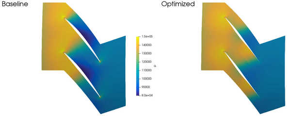
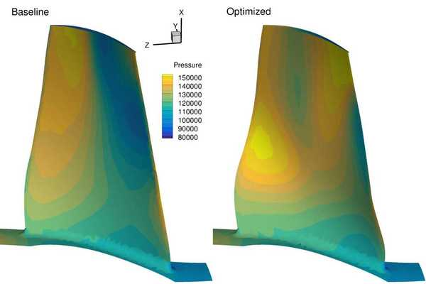
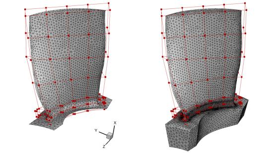

.. _Aerodynamics_Rotor67:

Axial compressor rotor
----------------------

**NOTE**: Before running this case, please read the instructions in :ref:`Aerodynamics_NACA0012_Incomp` to get an overall idea of the DAFoam optimization setup.

This is an aerodynamic shape optimization case for the Rotor67 axial compressor. The summary of the case is as follows:

    | Case: Axial compressor aerodynamic optimization at transonic conditions
    | Geometry: Rotor67
    | Objective function: Torque
    | Design variables: 80 FFD points moving in the y and z directions
    | Constraints: Constant mass flow rate and total pressure ratio
    | Tip Mach number: 1.38
    | Rotation speed: -1680 rad/s
    | Mesh cells: 60K
    | Adjoint solver: turboDAFoam

The configuration files are available at `Github <https://github.com/mdolab/dafoam/tree/master/tutorials/Aerodynamics/Rotor67>`_. To run this case, first source the DAFoam environment (see :ref:`Tutorials`). Then you can go into the **run** folder and run::

  ./Allrun.sh 8

The optimization progress will then be written in the **log.opt** file. 
**NOTE**, we recommend running this case on an HPC system using at least 8 CPU cores.

For this case, the optimization was run for 20 steps, see the following figure. 
The baseline design has C_M=0.08574, m=1.733 m^3/s, p1/p0=1.463, and the optimized design has C_M=0.0782, m=1.625 m^3/s, p1/p0=1.460.

The mesh and FFD points are as follows.
We use ICEM to generate the triangular meshes and FFD points.

