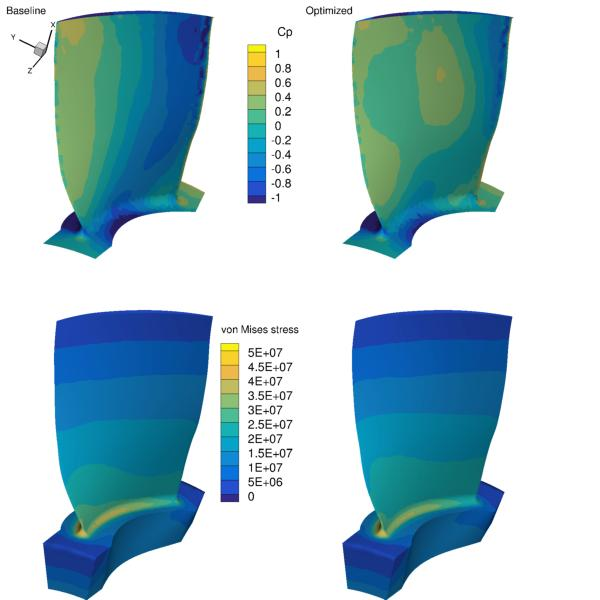

.. _Aerostructural_Rotor67:

Axial compressor rotor
----------------------

**NOTE**: Before running this case, please read the instructions in :ref:`Aerodynamics_NACA0012_Incomp` to get an overall idea of the DAFoam optimization setup.

This is an aerostructural optimization case for an axial compressor rotor (Rotor 67) at subsonic conditions. The summary of the case is as follows:

    | Case: Rotor67 Aerostructural optimization 
    | Geometry: Rotor 67: an axial compressor rotor   
    | Objective function: Torque
    | Design variables: 40 FFD points moving in the x, y, and z directions (120 design variables in total)
    | Constraints: Constant mass flow rate and total pressure ratio, von Misese stress constraint
    | Rotation speed: -840 rad/s (50% design speed)
    | Inlet absolute Mach number: 0.29
    | Reynolds number: 0.85 million
    | Mesh cells: 61K for fluid and 94K for solid
    | Adjoint solver: rhoSimpleDAFoam and solidDisplacementDAFoam

To run this case, first source the DAFoam environment (see :ref:`Tutorials`). Then you can go into the **runFluid** folder and run::

  ./Allrun.sh 4

The optimization progress will then be written in the **log.opt** file. 
The flow simulation results are stored in optOutputFluid and the solid simulation results are stored in optOutputSolid.

For this case, the optimization converges in 8 steps, see the following figure. 
The baseline design has C_M=0.01862, m=1.003 m^3/s, p1/p0=1.112, sigma=4.828e7 Pa, and the optimized design has C_M=0.01822, m=1.003 m^3/s, p1/p0=1.112, sigma=4.828e7 Pa.

The mesh and FFD points are as follows.
We use ICEM to generate the triangular meshes and FFD points.

.. image:: images/Rotor67_AS_Mesh.jpg

In this case, we couple two solvers: rhoSimpleDAFoam (flow simulation) and solidDisplacementDAFoam (structural analysis).
Again, they interact through file IO, so the foamRun.sh script is a bit different from that used in :ref:`Aerodynamics_NACA0012_Incomp`.
We also define new functions: ``evalConFuncs``, ``aeroFuncs``, and ``aeroFuncsSens`` in the runScript.py

