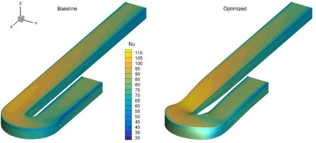

.. _Aerothermal_UBend:

U-bend internal cooling channel
-------------------------------

**NOTE**: Before running this case, please read the instructions in :ref:`Aerodynamics_NACA0012_Incomp` to get an overall idea of the DAFoam optimization setup.

This is an aerothermal optimization case for a U-bend internal cooling channel. The summary of the case is as follows:

    | Case: Aerothermal optimization for U bend cooling channels with radiation and buoyancy
    | Geometry: von Karman U bend duct
    | Objective function: Weighted pressure loss and Nusselt number
    | Design variables: 114 FFD points moving in the x, y, and z directions
    | Constraints: Symmetry and curvature constraints (total number: 41)
    | Mach number: 0.02
    | Reynolds number: 4.2e4
    | Mesh cells: 4.8K
    | Adjoint solver: buoyantBoussinesqSimpleDAFoam

The configuration files are available at `Github <https://github.com/mdolab/dafoam/tree/master/tutorials/Aerothermal/UBend>`_. To run this case, first source the DAFoam environment (see :ref:`Tutorials`). Then you can go into the **run** folder and run::

  ./Allrun.sh 1

The optimization progress will then be written in the **log.opt** file.

For this case, the optimization converges in 8 steps, see the following figure. 
The baseline design has CPL=1.152, Nu=76.82 and the optimized design has CPL=0.7764, Nu=78.73.

We use buoyantBoussinesqSimpleDAFoam, which contains heat transfer, buoyancy, and radiation.