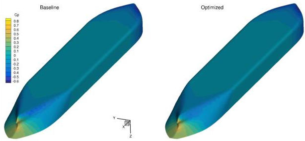
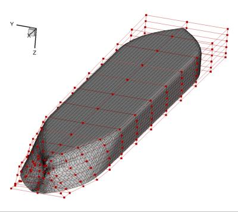

.. _Hydrodynamics_JBC:

Bulk carrier hull
-----------------

**NOTE**: Before running this case, please read the instructions in :ref:`Aerodynamics_NACA0012_Incomp` to get an overall idea of the DAFoam optimization setup.

This is a hydrodynamic optimization case for a bulk carrier hull (JBC). The summary of the case is as follows:

    | Case: Ship hydrodynamic optimization with self-propulsion
    | Geometry: Japan Bulk Carrier (JBC) hull
    | Objective function: Weighted drag and wake distortion
    | Design variables: 32 FFD points moving in the y direction
    | Constraints: Volume, thickness, symmetry, and curvature constraints (total number: 83)
    | Mach number: <0.01
    | Reynolds number: 7.5 million
    | Mesh cells: 40K
    | Adjoint solver: simpleDAFoam

The configuration files are available at `Github <https://github.com/mdolab/dafoam/tree/master/tutorials/Hydrodynamics/JBC>`_. To run this case, first source the DAFoam environment (see :ref:`Tutorials`). Then you can go into the **run** folder and run::

  ./Allrun.sh 4

The optimization progress will then be written in the **log.opt** file.

For this case, the optimization converges in 20 steps, see the following figure. 
The baseline design has C_D=001773 and the optimized design has C_D=0.001692.

We use simpleDAFoam and ignore the free surface. We generate the unstructure mesh using ``snappyHexMesh``. The mesh and FFD setup is as follows.

The runScript.py is written for multi objectives configurations where we can combine drag and wake distortion.
In this case, the weight for wake distortion is set to be 0.
We need to use more refined mesh to obtain an accurate wake distortion value. 
We also have a curvature constraint for this case.