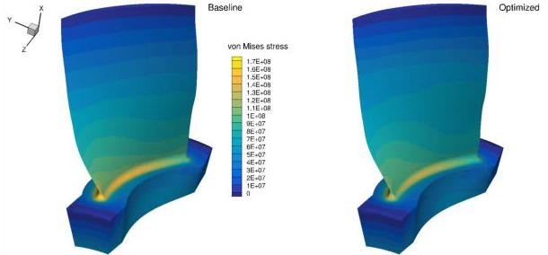

.. _Structure_Rotor67:

Axial compressor rotor
----------------------

**NOTE**: Before running this case, please read the instructions in :ref:`Aerodynamics_NACA0012_Incomp` to get an overall idea of the DAFoam optimization setup.

This is a structural optimization case for a axial compressor rotor (Rotor 67). The summary of the case is as follows:

    | Case: Structural optimization for the engine fan
    | Geometry: Rotor 67
    | Objective function: Maximal von Mises stress
    | Design variables: 120 FFD points moving in the x, y, and z directions
    | Constraints: None
    | Mesh cells: 94K
    | Adjoint solver: solidDisplacementDAFoam

The configuration files are available at `Github <https://github.com/mdolab/dafoam/tree/master/tutorials/Structure/Rotor67>`_. To run this case, first source the DAFoam environment (see :ref:`Tutorials`). Then you can go into the **run** folder and run::

  ./Allrun.sh 1

The optimization progress will then be written in the **log.opt** file.

For this case, the optimization converges in 4 steps, see the following figure. 
The baseline design has sigma=1.828e8 Pa and the optimized design has sigma=1.507e8 Pa.

We use solidDisplacementDAFoam. The mesh and FFD setup are same as :ref:`Aerostructural_Rotor67`.
The rotor runs at 1860 rad/s.